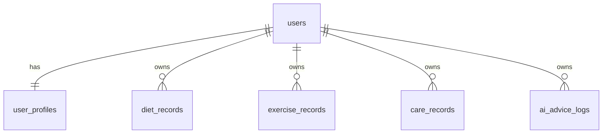

# 基于 Dify 工作流的个性化饮食、运动、个人护理追踪平台 MVP

这是一个以 Android App 为主的健康管理 MVP monorepo，当前结构聚焦在：

- `server/`：Spring Boot 后端接口
- `mobile/`：Expo + React Native 移动端

整体目标是先把 App 形态跑通，再逐步补强 AI 建议、用户目标和健康数据沉淀能力。

## 技术栈

- 移动端：Expo、React Native、TypeScript
- 后端：Spring Boot 3、Java 17、Maven
- 安全：Spring Security、JWT
- 数据访问：Spring Data JPA
- 数据库：MySQL 8
- 缓存预留：Redis
- AI 工作流：Dify API
- API 文档：OpenAPI / Swagger
- 部署：Docker Compose

## 项目结构

```text
.
├── .env.example
├── .gitignore
├── README.md
├── docker-compose.yml
├── scripts
│   ├── dev-mobile.sh
│   ├── dev-server.sh
│   └── dev-setup.sh
├── mobile
│   ├── .env.example
│   ├── app.json
│   ├── App.tsx
│   ├── package.json
│   ├── tsconfig.json
│   └── src
│       ├── components
│       ├── lib
│       ├── screens
│       └── types.ts
└── server
    ├── Dockerfile
    ├── mvnw
    ├── pom.xml
    └── src
```

## 当前 MVP 功能

- 用户注册 / 登录 / JWT 鉴权
- 用户资料与健康目标维护
- 饮食记录、运动记录、护理记录的新增与按日期查询
- 仪表盘汇总与近 7 天趋势展示
- Dify AI 建议接口骨架与建议日志留存
- 后端不可用时的 mock 回退演示

## 环境变量

根目录 `.env.example` 用于后端与 Docker：

- `MYSQL_HOST`
- `MYSQL_PORT`
- `MYSQL_DB`
- `MYSQL_USER`
- `MYSQL_PASSWORD`
- `MYSQL_ROOT_PASSWORD`
- `JWT_SECRET`
- `DIFY_BASE_URL`
- `DIFY_API_KEY`
- `DIFY_WORKFLOW_ID`
- `REDIS_HOST`
- `REDIS_PORT`
- `SPRING_PROFILES_ACTIVE`

移动端单独使用 `mobile/.env.example`：

- `EXPO_PUBLIC_API_BASE_URL`

常见取值：

- Android 模拟器：`http://10.0.2.2:8080`
- Android 真机：`http://<你的局域网 IP>:8080`

## 本地启动

### 1. 准备根目录环境变量

```bash
cp .env.example .env
```

### 2. 启动 MySQL / Redis

如果本机装了 Docker：

```bash
docker compose up -d mysql redis
```

或者直接使用：

```bash
./scripts/dev-setup.sh
```

### 3. 启动后端

```bash
cd server
./mvnw spring-boot:run
```

或使用脚本：

```bash
./scripts/dev-server.sh
```

默认端口：`8080`

Swagger：

- `http://localhost:8080/swagger-ui.html`

如果你只想做本地轻量联调，也可以用 H2 profile：

```bash
cd server
SPRING_PROFILES_ACTIVE=local ./mvnw spring-boot:run
```

### 4. 启动移动端

先复制移动端环境变量：

```bash
cd mobile
cp .env.example .env
```

然后启动：

```bash
npm install
npm run android
```

或使用根目录脚本：

```bash
./scripts/dev-mobile.sh
```

## Docker 启动

当前 `docker-compose.yml` 负责启动：

- MySQL
- Redis
- Server

执行方式：

```bash
cp .env.example .env
docker compose up --build
```

启动后默认访问：

- 后端：`http://localhost:8080`
- Swagger：`http://localhost:8080/swagger-ui.html`

移动端仍建议本机通过 Expo 启动。

## ER 图



## 当前状态

已完成：

- `mobile/` Android MVP 客户端骨架
- 登录 / 注册
- 仪表盘、饮食、运动、护理、AI 建议页面
- 本地会话存储
- 对接现有 Spring Boot API
- TypeScript 检查通过
- Expo Android bundle 导出验证通过

说明：

- 当前环境下 Hermes bytecode 导出会遇到系统级 `EPERM`，所以本仓库里的验证使用了 `--no-bytecode`
- 这不影响你继续在本机模拟器或真机上做开发联调

## 后续建议

### V1

- 把 `mobile/` 的类型、mock、API DTO 继续抽成共享层
- 补表单校验、错误提示、空状态和加载态细化
- 增加更适合移动端的图表与趋势卡片

### V2

- 接入真实 Dify Workflow Prompt 编排
- 引入 Redis 缓存、异步任务、消息通知
- 增加推送与每日提醒

### V3

- 增加家庭成员、多角色、多设备数据同步
- 增加 AI Coach、趋势分析、干预提醒

## 项目亮点

- 纯 App 导向的 monorepo，结构比原先更聚焦
- 后端接口和移动端节奏可以并行推进
- 支持 mock + API 混合开发，适合 MVP 快速验证
- Dify 接口已预留，后续可快速接入真实 AI 能力
