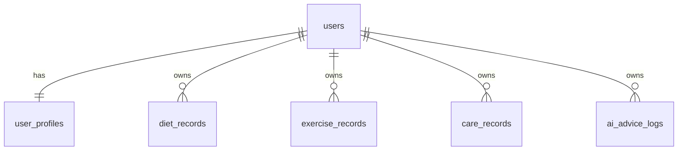

# 基于 Dify 工作流的个性化饮食、运动、个人护理追踪平台 MVP

一个偏轻量、可快速启动的健康管理 monorepo MVP：提供饮食记录、运动记录、个人护理记录、用户目标管理，以及基于 Dify 工作流的 AI 建议接口骨架。整体目标是 **先跑起来、先能演示、再逐步迭代**。

## 项目简介

- 面向个人健康管理场景，聚焦饮食、运动、个人护理 3 个核心方向
- 提供 Spring Boot + Next.js 的最小可运行骨架
- 兼顾本地开发和 Docker Compose 一键启动
- AI 建议通过 Dify API 做统一封装，MVP 阶段允许 mock / fallback 混合演示

## 技术栈

- 前端：Next.js 14、TypeScript、Tailwind CSS、Recharts
- UI：shadcn/ui 风格自定义轻量组件
- 后端：Spring Boot 3、Java 17、Maven
- 安全：Spring Security、JWT
- 数据访问：Spring Data JPA
- 数据库：MySQL 8
- 缓存预留：Redis
- AI 工作流：Dify API
- API 文档：OpenAPI / Swagger
- 部署：Docker Compose

## 项目目录结构

```text
.
├── .env.example
├── .gitignore
├── README.md
├── docker-compose.yml
├── scripts
│   ├── dev-server.sh
│   ├── dev-setup.sh
│   └── dev-web.sh
├── server
│   ├── .mvn
│   │   └── wrapper
│   │       └── maven-wrapper.properties
│   ├── Dockerfile
│   ├── mvnw
│   ├── pom.xml
│   └── src
│       └── main
│           ├── java
│           │   └── com
│           │       └── healthtrack
│           │           └── mvp
│           │               ├── HealthTrackApplication.java
│           │               ├── config
│           │               │   ├── JwtAuthenticationFilter.java
│           │               │   ├── OpenApiConfig.java
│           │               │   ├── RestClientConfig.java
│           │               │   ├── SecurityConfig.java
│           │               │   └── SeedDataInitializer.java
│           │               ├── controller
│           │               │   ├── AdviceController.java
│           │               │   ├── AuthController.java
│           │               │   ├── DashboardController.java
│           │               │   ├── ProfileController.java
│           │               │   └── RecordController.java
│           │               ├── domain
│           │               │   ├── AiAdviceLog.java
│           │               │   ├── CareRecord.java
│           │               │   ├── DietRecord.java
│           │               │   ├── ExerciseRecord.java
│           │               │   ├── User.java
│           │               │   └── UserProfile.java
│           │               ├── dto
│           │               │   ├── AdviceDtos.java
│           │               │   ├── AuthDtos.java
│           │               │   ├── DashboardDtos.java
│           │               │   ├── ProfileDtos.java
│           │               │   └── RecordDtos.java
│           │               ├── integration
│           │               │   └── dify
│           │               │       └── DifyClient.java
│           │               ├── repository
│           │               │   ├── AiAdviceLogRepository.java
│           │               │   ├── CareRecordRepository.java
│           │               │   ├── DietRecordRepository.java
│           │               │   ├── ExerciseRecordRepository.java
│           │               │   ├── UserProfileRepository.java
│           │               │   └── UserRepository.java
│           │               ├── security
│           │               │   └── AppUserPrincipal.java
│           │               ├── service
│           │               │   ├── AdviceService.java
│           │               │   ├── AuthService.java
│           │               │   ├── CustomUserDetailsService.java
│           │               │   ├── DashboardService.java
│           │               │   ├── JwtService.java
│           │               │   ├── ProfileService.java
│           │               │   └── RecordService.java
│           │               └── util
│           │                   └── SecurityUtils.java
│           └── resources
│               ├── application-dev.yml
│               └── application.yml
└── web
    ├── Dockerfile
    ├── app
    │   ├── advice
    │   │   └── page.tsx
    │   ├── care
    │   │   └── page.tsx
    │   ├── dashboard
    │   │   └── page.tsx
    │   ├── diet
    │   │   └── page.tsx
    │   ├── exercise
    │   │   └── page.tsx
    │   ├── globals.css
    │   ├── layout.tsx
    │   ├── login
    │   │   └── page.tsx
    │   └── page.tsx
    ├── components
    │   ├── app-shell.tsx
    │   └── ui
    │       ├── button.tsx
    │       ├── card.tsx
    │       ├── input.tsx
    │       ├── label.tsx
    │       └── textarea.tsx
    ├── lib
    │   ├── api.ts
    │   ├── auth.ts
    │   ├── mock.ts
    │   └── utils.ts
    ├── next.config.mjs
    ├── package.json
    ├── postcss.config.js
    ├── tailwind.config.ts
    ├── tsconfig.json
    └── types
        └── index.ts
```

## 核心功能说明

- 用户注册 / 登录 / JWT 基础鉴权
- 用户资料与健康目标维护
- 饮食记录、运动记录、个人护理记录的新增与按日期查询
- 仪表盘汇总接口与前端可视化
- Dify AI 建议接口骨架与建议日志留存
- Docker Compose 一键拉起数据库、缓存、前后端

## 环境变量说明

后续将在 `.env.example` 中提供完整示例，至少包括：

- `MYSQL_HOST`
- `MYSQL_PORT`
- `MYSQL_DB`
- `MYSQL_USER`
- `MYSQL_PASSWORD`
- `JWT_SECRET`
- `DIFY_BASE_URL`
- `DIFY_API_KEY`
- `DIFY_WORKFLOW_ID`
- `REDIS_HOST`
- `REDIS_PORT`

## 本地运行方式

### 1. 准备环境变量

```bash
cp .env.example .env
```

### 2. 启动依赖（MySQL / Redis）

如果你本机装了 Docker：

```bash
docker compose up -d mysql redis
```

如果你本机没有 Docker，也可以手动准备：

- MySQL 8
- Redis 7

并确保配置与 `.env.example` 对应。

### 3. 启动后端

当前后端已经补上 **Maven Wrapper**，所以即使机器上没装 Maven，也可以直接启动：

```bash
cd server
./mvnw spring-boot:run
```

或者直接使用根目录脚本：

```bash
./scripts/dev-server.sh
```

默认端口：`8080`

接口文档：

- `http://localhost:8080/swagger-ui.html`

### 4. 启动前端

```bash
cd web
npm install
npm run dev
```

或者直接使用根目录脚本：

```bash
./scripts/dev-web.sh
```

默认端口：`3000`

访问地址：

- `http://localhost:3000`

## Docker 启动方式

```bash
cp .env.example .env
docker compose up --build
```

如果你只是想先把依赖准备好，也可以先运行：

```bash
./scripts/dev-setup.sh
```

启动后默认访问：

- 前端：`http://localhost:3000`
- 后端：`http://localhost:8080`
- Swagger：`http://localhost:8080/swagger-ui.html`

## ER 图（Markdown）



## 当前可运行状态

我在当前机器上做过一轮 smoke check，结论如下：

- ✅ 前端 `web/` 已成功执行 `npm run build`
- ✅ 前端页面路由已生成：`/`、`/login`、`/dashboard`、`/diet`、`/exercise`、`/care`、`/advice`
- ✅ 根目录关键文件已生成：`README.md`、`.env.example`、`docker-compose.yml`
- ✅ 后端关键骨架已生成：`pom.xml`、`application.yml`、Controller / Service / Repository / Entity / JWT 安全模块
- ✅ 已补充 `server/mvnw` 与 `.mvn/wrapper/maven-wrapper.properties`
- ✅ 后端已成功执行：`./mvnw -v`
- ✅ 后端已成功执行：`./mvnw -q -DskipTests package`
- ✅ 已补充根目录辅助脚本：`scripts/dev-setup.sh`、`scripts/dev-server.sh`、`scripts/dev-web.sh`
- ⚠️ 当前机器 **没有 Docker**，所以我无法在这里实际执行 `docker compose up` 做容器联调

也就是说：

- **前端可构建性：已验证通过**
- **后端可编译性：已验证通过**
- **容器联调：受当前机器环境限制，尚未在本机跑通**

如果你后面在装有 Docker 的环境里跑，这个项目已经具备继续验证和修补的基础。

## 后续迭代建议

### V1

- 完善表单校验、错误提示、分页与筛选
- 补充用户画像、建议模板和健康周报

### V2

- 接入真实 Dify Workflow Prompt 编排
- 引入 Redis 缓存、异步任务、消息通知

### V3

- 增加多角色、家庭成员、多设备数据同步
- 增加 AI Coach、趋势分析、干预提醒

## 项目亮点

- 轻量 monorepo，适合比赛答辩和快速 MVP 演示
- 前后端分离但结构克制，避免空壳工程
- 支持 mock + API 混合开发，便于并行推进
- Dify 工作流接口已预留，后续可快速接入真实 AI 能力
